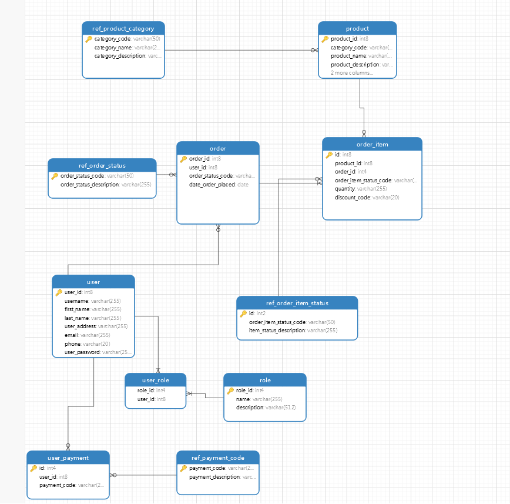

# online-shop

## Introduction
An online shop Rest API practicing Spring Boot
### Technical stack
- Spring Boot
- Spring Security, Spring REST, Spring Data
- lombok
- Postgres database

### Database schema

### Prerequisites
- Java JDK 11
- Maven 3

### Usage
There are several ways to run a Spring Boot application on your local machine. One way is to execute the main method in the Application class from your IDE.
 Alternatively you can use the Spring Boot Maven plugin like so:
mvn spring-boot:run

