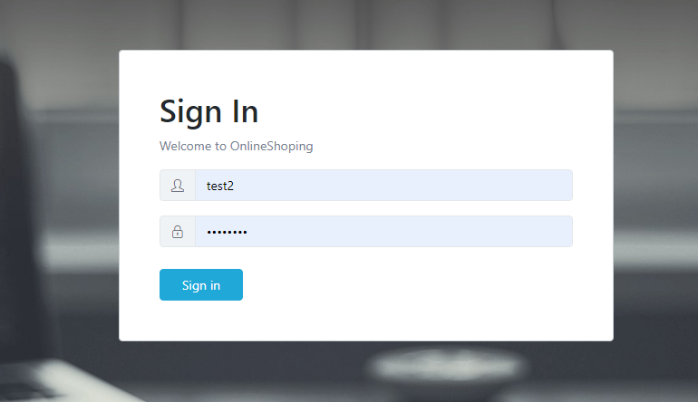
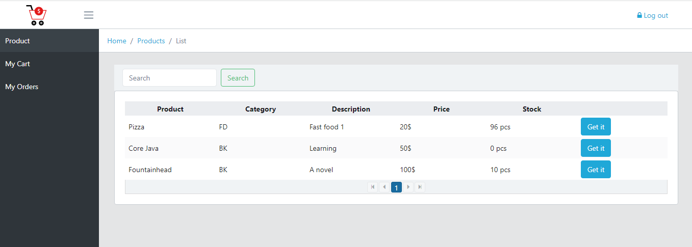
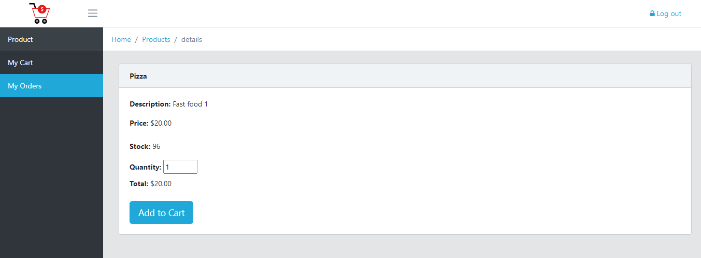
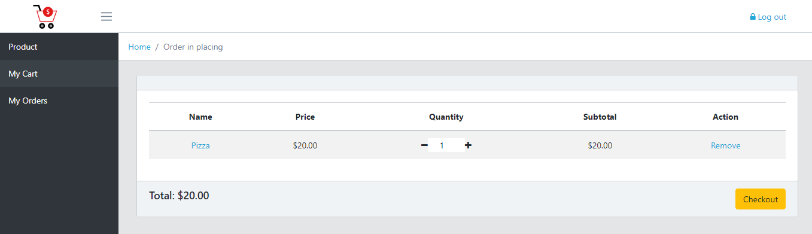
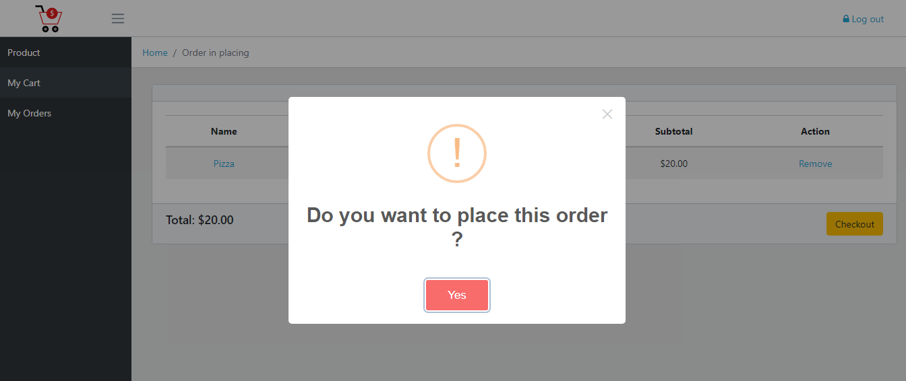
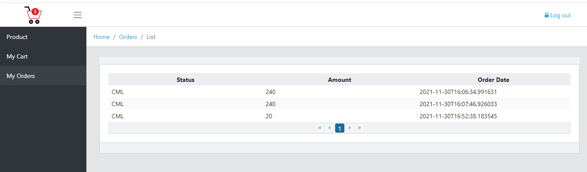

# online-shop

## Introduction
An online shop Rest API practicing Spring Boot
### Technical stack
- Java 11
- Spring Boot 2.5
- Spring Security, Spring REST, Spring Data JPA
- JWT authentication
- Postgres database
- Angular 9

### Database schema

### Prerequisites
- Java JDK 11
- Maven 3
- Angular CLI 9
- Node 12

### Usage

__Backend__

- cd `online-shop-back`
- Configuration data source at `application.yml`
- Run `mvn install`
- Run `mvn spring-boot:run`
- _By default the backend server will run on `http://localhost:8080/`_

__FrontEnd__

- cd `online-shop-angular`
- Run `npm install`
- Run `ng serve --open`
- _By default the frontend will run on `http://localhost:4200/`_

### App Pages

